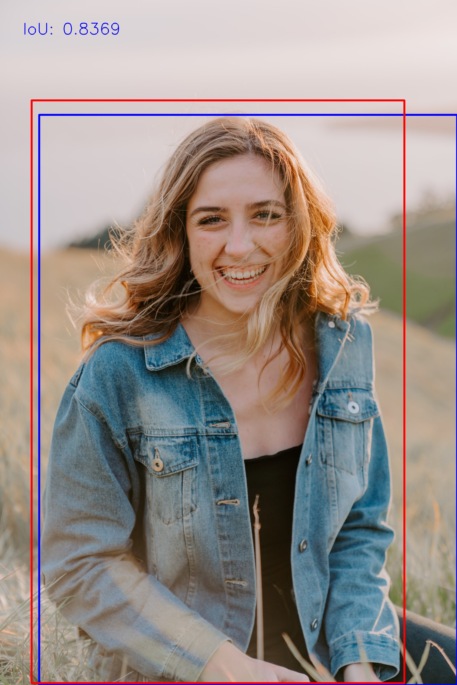
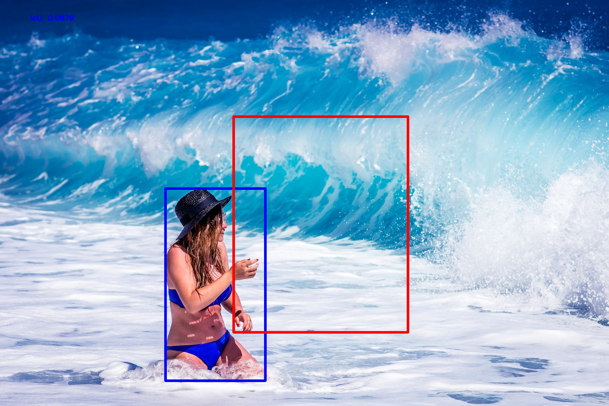
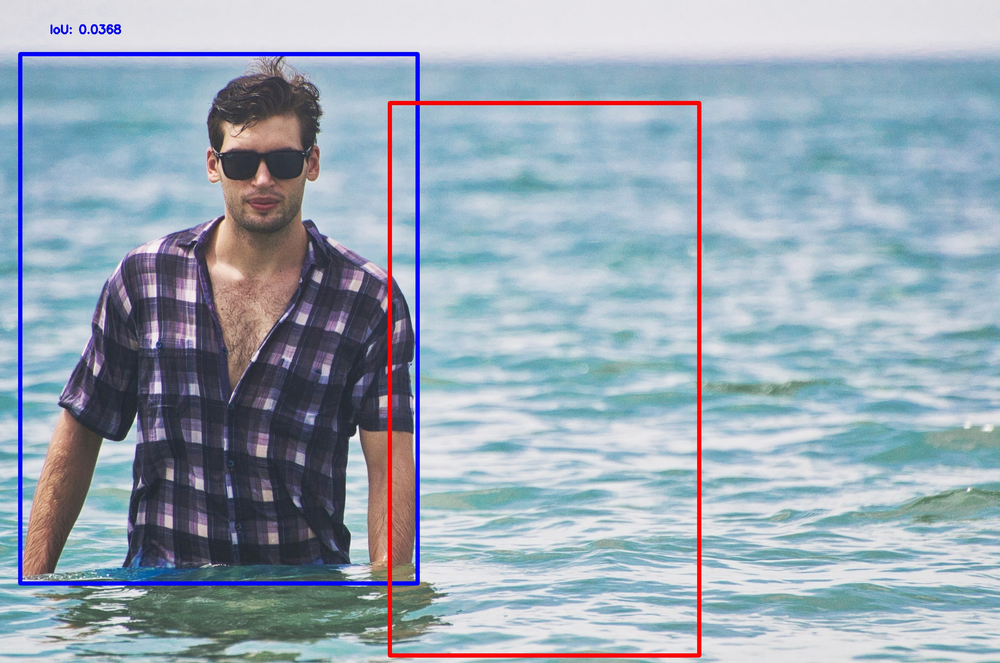

# Simple Object Detection
Implementation of a basic object detector from scratch using TensorFlow. Here, the model will predict one boundng box per image, i.e., detecting only one object per image

## Dataset
Download the dataset: [Human Detection](https://www.kaggle.com/datasets/nikhilroxtomar/human-detection/download?datasetVersionNumber=1)

## Weight file
Download the weight file from here: [model.h5](https://drive.google.com/file/d/1t-OUr1LMv8Qr_0OlAK8EDfn58tdDC6W0/view?usp=share_link)

## Results
Here are a few images from the test dataset. The blue bounding box refers to the ground-truth while the read refers to the predicted bounding box.

### Best Cases

### Worst Cases

