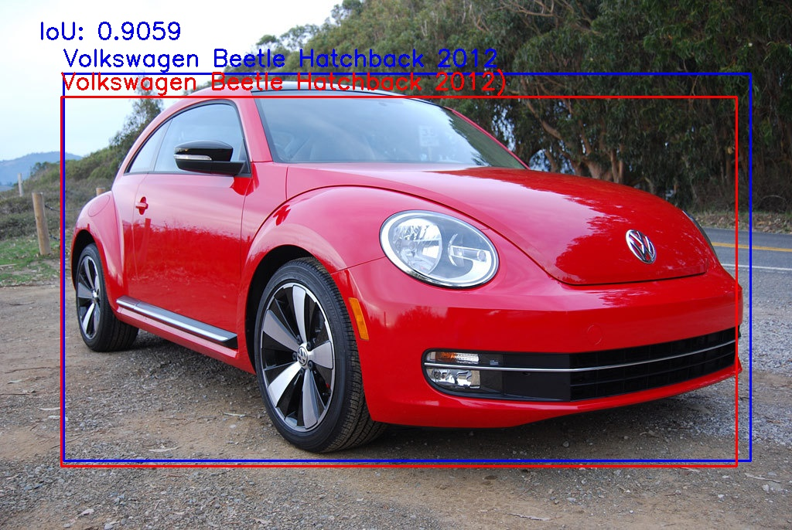
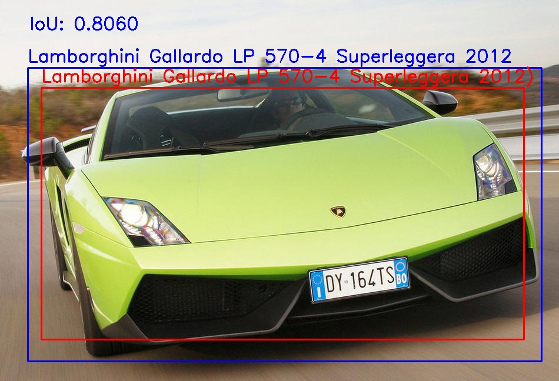

# Simple Object Detection with Localization and Classification
A simple implementation of an object detection on the Stanford Car Detection dataset in the TensorFlow.

## Dataset
Download the dataset: [Stanford Car Dataset](https://www.kaggle.com/datasets/jutrera/stanford-car-dataset-by-classes-folder/download?datasetVersionNumber=2)

## Checkpoint
Download the weight file: [model.h5](https://drive.google.com/file/d/1JhMBtcC5tR7Lu9D-W3yofCvEfnOCJ_Jb/view?usp=share_link)

## Results
Here are a few images from the test dataset. The blue bounding box refers to the ground-truth while the read refers to the predicted bounding box.

